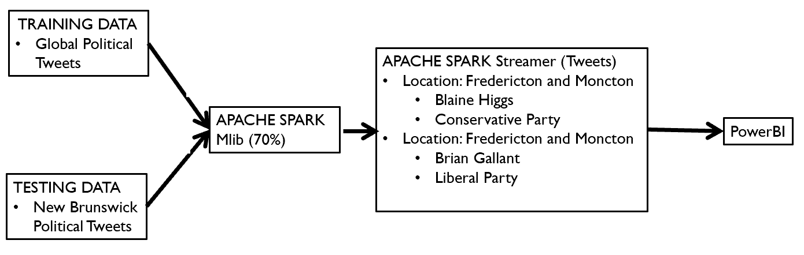
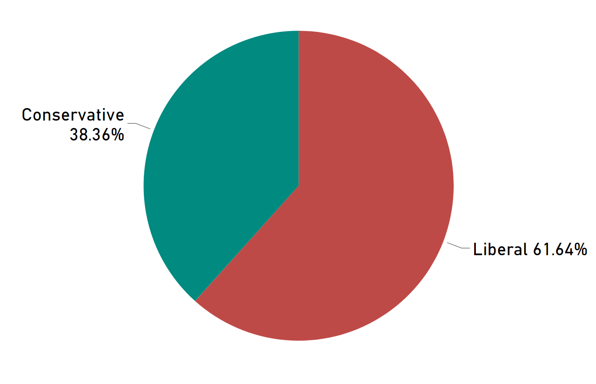

# Twit_Predict
<h2> Introduction </h2>
  Politics is a complex field and the success of a campaign is driven by widespread public approval. These campaigns can be a costly process as it involves telemarketing, travelling, pep rallies etc. As a result of this, determining a target population is crucial and social media is a big source of data that can be harnessed to assess this. By combining sentiment analysis with social media (i.e. Twitter) this study investigates two political candidates i.e. Brian Gallant (Liberal Party) and Blaine Higgs (Progressive Conservative Party) for the upcoming New Brunswick General Election in September of 2018. Predictions will be calculated based on the sentiment of a user opinion. The results yield insight on their predicted success and it will allow those political groups to adapt their campaign strategy accordingly. Furthermore, the results will be categorized by location and thus a given candidate can be given forecasts based on a specific location; Fredericton and Moncton were chosen for this study. 
  
 <h2> Methods </h2>
  All code was written in Python. The project involved several phases, specifically, initial importing of the tweets, then the machine learning algorithm and final plotting of the results (Fig. 1). We created our own training data in order to increase the accuracy of the results. Several scripts were used to conduct Sentiment Anyalsis on Tweets that were imported using Tweepy. Furthermore, we were able to find a customized poltical lexicon (Lexicon_dict.json) in this process. The study then used Apache Spark's MLib to create a model using logistic regression with a binary classification (i.e. positive or negative). We were also able to group the tweets based on location, and in this study we used two of the largest cities in New Brunswick, i.e. Fredericton and Moncton. Finally, the results were plotted in real time using PowerBI.  
  
  Figure 1: Methology used in this project. 

Training Data: analysis.csv 
 <h2> Final Results </h2>
  We were able to get a real time analysis of the tweets via location. The final results for all of New Brunswick are summarized below (Fig. 2). As expected from previous elections and polls, the Liberal party has a lead on the Conservative. 
 

 
Figure 2: Final results of the project. 
